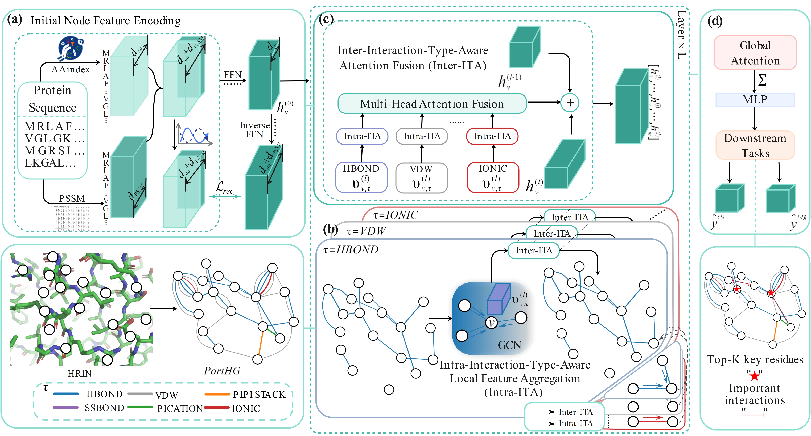

# Heterogeneous Graph Protein Residue Interaction Fusion Network model (HG-RIFN)


## Overview

In this project, we provide a specific implementation of HG-RIFN in Pytorch. The organizational structure of this code repository is as follows:

+ ```baseLineModels/``` stores all baseline algorithm implementations, such as GCN.py (GCN code).

## RUN

Run the ```main_reg.py``` file, which is the main script file used to ***train*** the protein thermal stability **regression** model. The following options are supported:
```bash
python main_reg.py [--input] [--results] [--data] [n_trials] [--cuda]
```

Run the ```main_cls.py``` file, which is the main script file used to ***train*** the protein thermal stability **classification** model. The following options are supported:
```bash
python main_cls.py  [--input] [--results] [--data] [n_trials] [--cuda]
```
Run the test_cls.py file, which is the main script file used to ***test*** the saved optimal protein thermal stability **regression** model. The following options are supported:
```bash
python test_reg.py 
```

Run the test_cls.py file, which is the main script file used to ***test*** the saved optimal protein thermal stability **classification** model. The following options are supported:
```angular2html

```

## Cite


