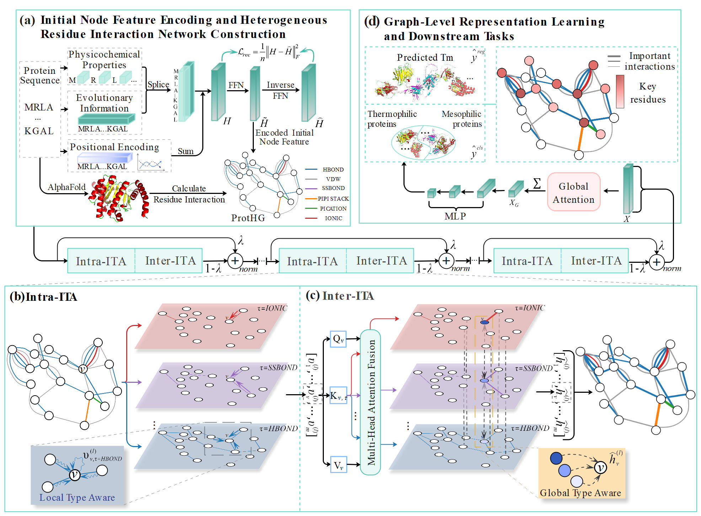

# Residue Interaction Type-Aware Heterogeneous Graph Embedding model (RIT-HetGE)


## Overview

In this project, we provide a specific implementation of RIN-HetGE in Pytorch. The organizational structure of this code repository is as follows:

+ ```EXP/``` stores all baseline algorithms for solving graph classification and regression problems, such as GCN.py (GCN code), DHNE.py (DHNE code) and so on.

## Installation

Install the latest version with:

```bash
git clone https://github.com/ElijahLIU7/RIT-HetGE.git
cd RIT-HetGE
pip install -r requirements.txt
```

## Data preprocessing

For the specific [HRIN-ProTstab](https://huggingface.co/datasets/ElijahL/HRIN-ProTstab) dataset download, please click on the URL. Place the downloaded dataset in path ```data/HRIN-ProTstab``` to complete the algorithm implementation.

Run the ```data/main_reg.py``` file, which is a script file used to query ***pLDDT*** for Alphafold3-predicted protein structures. The following options are supported:

```bash
python data/HRIN-ProTstab/preprocess/pLDDT.py [--dataset]
```

Next, run ```dataset/RIN_generation.py``` file to create data that matches the model input.

```bash
python dataset/RIN_generation.py [--output_dir] [--data_type] [--num_cross]
```

## RUN

Run the ```main_reg.py``` file, which is the main script file used to ***train*** the protein thermal stability **regression** model. The following options are supported:
```bash
python script/main_reg.py [--input] [--results] [--data] [n_trials] [--cuda]
```

Run the ```main_cls.py``` file, which is the main script file used to ***train*** the protein thermal stability **classification** model. The following options are supported:
```bash
python script/main_cls.py  [--input] [--results] [--data] [n_trials] [--cuda]
```
Run the test_cls.py file, which is the main script file used to ***test*** the saved optimal protein thermal stability **regression** model. The following options are supported:
```bash
python script/test_reg.py [--input] [--results] [--data] [--cuda]
```

Run the test_cls.py file, which is the main script file used to ***test*** the saved optimal protein thermal stability **classification** model. The following options are supported:
```bash
python script/test_cls.py [--input] [--results] [--data] [--cuda]
```

## Cite us
```bibtex
@article{LIU2026108707,
  title = {RIT-HetGE: A residue interaction type-aware heterogeneous graph-embedding model for predicting protein thermal stability},
  journal = {Neural Networks},
  volume = {199},
  pages = {108707},
  year = {2026},
  issn = {0893-6080},
  doi = {https://doi.org/10.1016/j.neunet.2026.108707},
  url = {https://www.sciencedirect.com/science/article/pii/S0893608026001693},
  author = {Lingzhi Liu and Yingying Jiang and Yanbin Gu and Shiming Zhao and Yanrui Ding}
}
```
